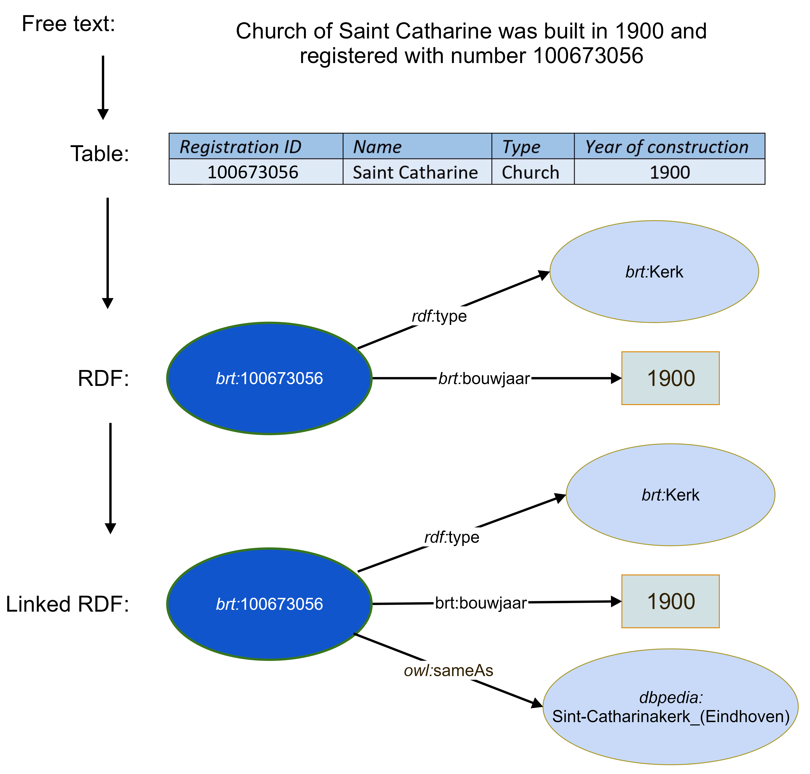

## Linked data principles

Linked Data is a method of publishing structured data so that it can be linked and queried.
It is built on the Semantic Web technology, and is driven by open standards set by the World
Wide Web Consortium (W3C). The term was  invented by [Sir Tim Berners-Lee](https://pdfs.semanticscholar.org/566c/1c6bd366b4c9e07fc37eb372771690d5ba31.pdf) who also set [the four
design rules]((https://www.w3.org/DesignIssues/LinkedData.html)) that are often used to define linked data. They are as follows:

1. Use [URIs](https://en.wikipedia.org/wiki/Uniform_Resource_Identifier) as names for things
2. Use HTTP URIs so that people can look up those names
3. When someone looks up a URI, provide useful information, using the standards  ([RDF](https://www.w3.org/RDF/) and [SPARQL](https://www.w3.org/TR/rdf-sparql-query/))
4. Include links to other URIs so that people can discover more things

Although these design rules look simple, it is far more complicated when diving into the world of linked
data. The first two principles touch upon the use of HTTP URIs to name things. In the concept of the
Semantic Web HTTP URIs are used as names for real-world objects and abstract concepts rather than as
addresses for Web documents. The content of a data set is structured using a simple graph-based data
model– *the Resource Description Framework (RDF)* . In RDF, a resource is described as a set of statements
called triples or facts. A triple represents the basic structure of a sentence consisting of three parts,
namely a subject, predicate and an object.

These three parts can be expressed as URIs, but objects can also be literal. In general, the subject
defines the described resource, the predicate, in the middle, shows what kind of relation exists between
subject and object and object is another resource that has a relation with subject. There are several
serializations of RDF, but XML-based is the most common format.

It consists of a subject expressed as a URI, predicate (also URI) and an object
that can be either a liter or a URI. "/>

The figure above shows an example triple representing a simple fact that an object registered in the key
registry of topography (BRT) with the number 117763908 is a church (kerk in Dutch). The first part
of a triple, namely subject, is represented by a URI coined to hold the unique identification of
the building. The URI resides in the BRT namespace and is shorten in the Figure to “brt”.
Any registered attribute of this particular building will be linked to the subject via a predicate.
In the Figure, the predicate (RDF namespace ) defines a type of the building, for instance,
it is a church (kerk). A URI to define churches represents on objet of a triple.
This URI originates from the BRT ontology (the same BRT namespace), a collection of
formal concept definitions and relations.

## Power of Linked Data

The example given in the Figure above demonstrates the use of the first three Linked Data design rules. However,
The real power of Linked Data is in the last forth rule - *Include links to other URIs so that people can discover more things*.
By implementing this rule data becomes a part of an unbounded data space on the Web Of Data

The figure below walks through the transformation steps to be taken to improve usability of a tabular by enriching it with the structures and semantics.
Let us imagine that the Dutch Kadaster registered a building
of the Saint Catharine church erected in 1900 with a certain registration ID. In the figure below, this is shown as free text.
To make it machine-readable the data has to be structured, for example as a table. In this way, the free text is decomposed
into smaller bits of information, which are written in a formal structure. The columns of the table contain semantically
similar information. For example, it is assumed that the column with the name Registration ID hold only records with such ID,
the opposite would be considered an error.

 

However, even though the computers can read the tables, it is not possible for them to reason upon such structures.
To enable reasoning, a formal representation of the concepts and relations used in the data should be decoupled from
the data structure . The RDF data model together with ontologies provides means for capturing formal semantics independently
from the data structure. As can be seen from the Figure, the table resulted in two triples one about the fact that the building
is a church (kerk) and the other one says the year of constructions (bouwjaar means “year of construction” in Dutch).
The URIs used in the triple explicitly define unique identifications for types and relations between data items.
The Linked RDF, in the Figure, has an additional third triple that states that the registered building is the
same building as described in DBpedia  (owl:sameAs is used). This makes the Linked Data linked.